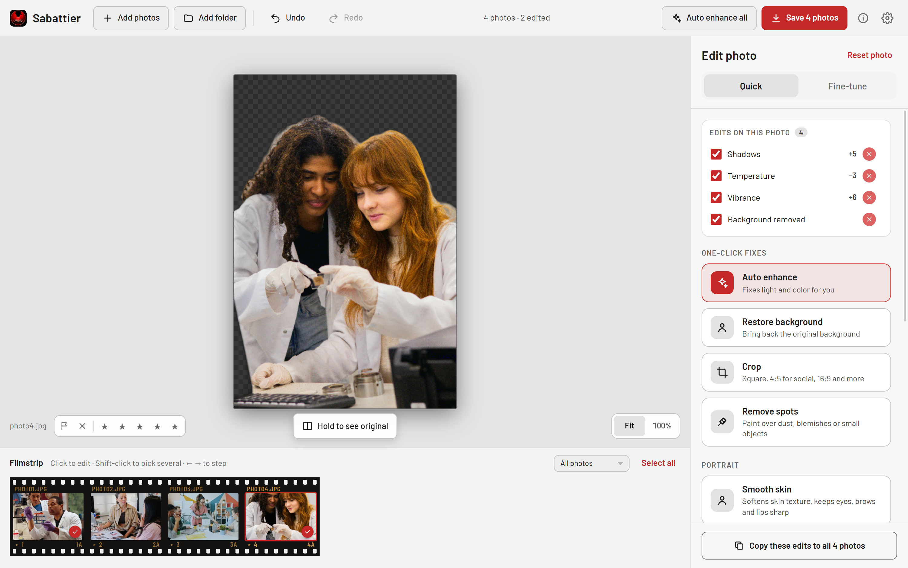
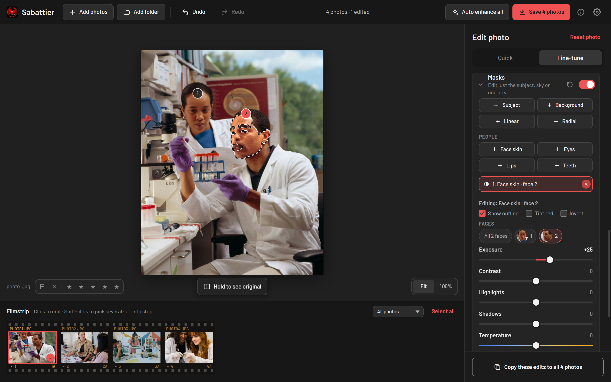
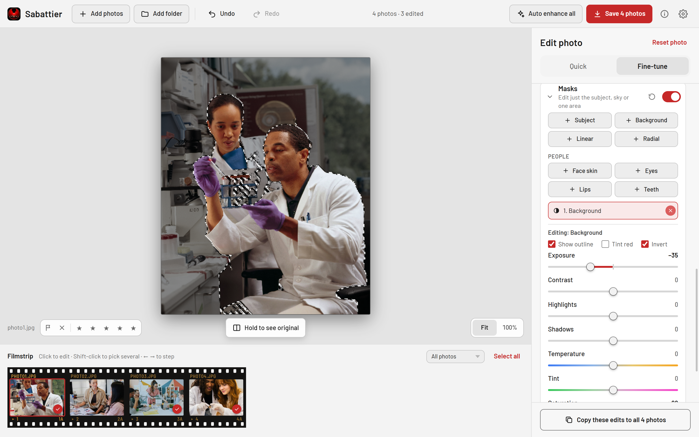
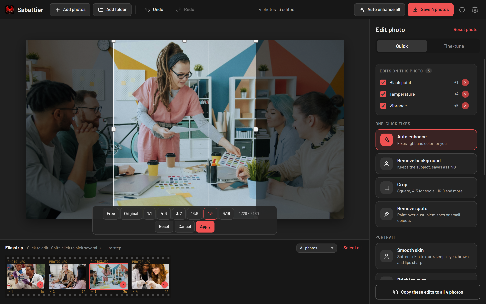
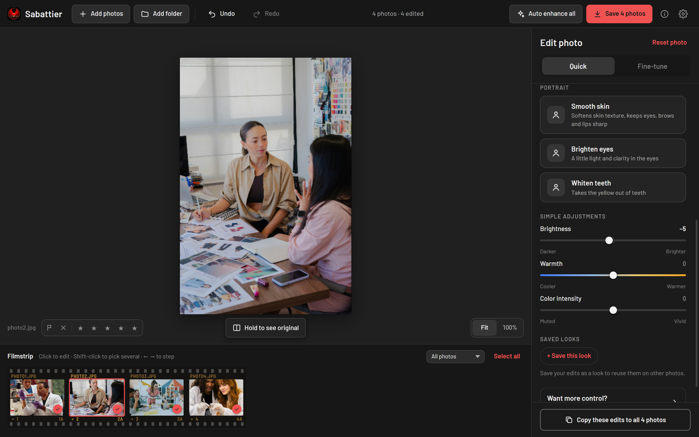
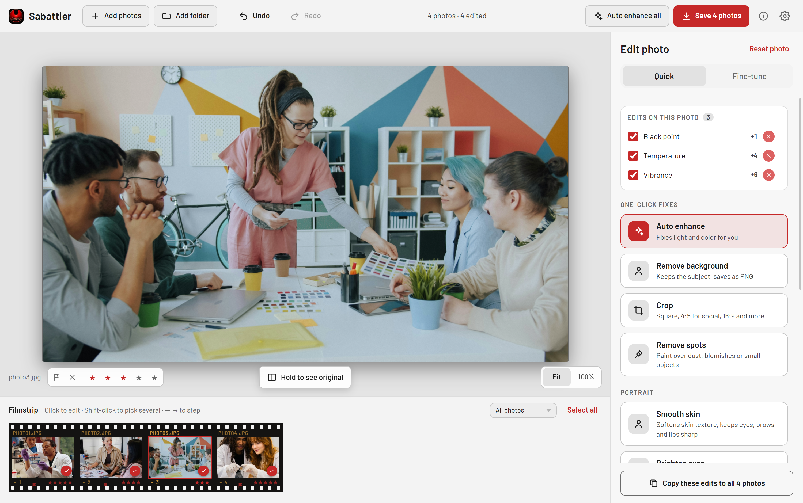
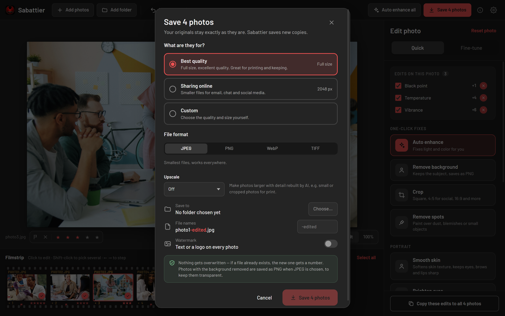

# Sabattier

A fast, batch photo color editor for macOS and Windows. Import a folder of photos
(including RAW camera files), fix the lighting with Pixelmator-style adjustments or the
histogram-driven **Auto Enhance**, and export everything as high-quality JPEGs.


See [CHANGELOG.md](CHANGELOG.md) for what changed in each release.



## Download

Get the latest installer from the
[releases page](https://github.com/sina5/sabattier/releases/latest):

| System | Installer | With every AI model included |
| --- | --- | --- |
| Windows (64-bit) | `Sabattier-<version>-windows-x64.setup.exe` | `…-windows-x64-with-models.setup.exe` |
| macOS (Apple Silicon) | `Sabattier-<version>-macos-arm64.dmg` | `…-macos-arm64-with-models.dmg` |

The standard installer is small and downloads each AI model the first time you use
the tool that needs it. The *with models* installer is about 575 MB larger and works
fully offline from the start.

The installers are not code-signed yet, so your system warns you the first time:

- **Windows**: on the SmartScreen prompt, choose *More info* → *Run anyway*.
- **macOS**: if the app is blocked, open *System Settings → Privacy & Security* and
  choose *Open Anyway*.

## Screenshots

<table>
  <tr>
    <td width="50%"></td>
    <td width="50%"></td>
  </tr>
  <tr>
    <td><b>Face masks</b> — pick a face and edit just its skin, eyes, lips or teeth.</td>
    <td><b>Background mask</b> — darken or recolor everything behind the subject.</td>
  </tr>
  <tr>
    <td></td>
    <td></td>
  </tr>
  <tr>
    <td><b>Crop</b> — free or fixed ratios such as 1:1, 4:5 and 16:9.</td>
    <td><b>Portrait retouch</b> — smooth skin, brighten eyes, whiten teeth.</td>
  </tr>
  <tr>
    <td></td>
    <td></td>
  </tr>
  <tr>
    <td><b>Rate and pick</b> — star, flag or reject photos and filter the filmstrip.</td>
    <td><b>Export</b> — JPEG, PNG, WebP or TIFF, AI upscaling and watermarks.</td>
  </tr>
</table>

Sample photos are from Unsplash; see [images/README.md](images/README.md) for credits.

## Features

- **Batch workflow** — import files or whole folders, edit one photo, *Copy these edits to all*,
  or run *Auto enhance all* to analyze and correct every photo individually.
- **Auto Enhance** — histogram analytics per image: gray-world white balance,
  percentile-based exposure and black point, clipping-aware highlight/shadow recovery,
  dynamic-range-based contrast. Results land in the normal sliders so you can fine-tune.
- **Adjustments** — White Balance (temperature/tint), Light (exposure, highlights,
  shadows, brightness, contrast, whites, black point), Hue & Saturation (hue, saturation,
  vibrance), 3-Way Color Balance (shadow/midtone/highlight color wheels + luminance).
  All GPU-accelerated (WebGL2), real-time, with a live RGB histogram.
- **Tone curve** — point curves for RGB and each of red, green and blue (monotone
  splines, so they never overshoot), drawn over the live histogram.
- **Color mixer** — hue, saturation and luminance for eight color bands (red through
  magenta), blended smoothly between bands.
- **Effects and detail** — texture, clarity, dehaze, vignette, film grain (with size)
  and sharpening. Clarity and dehaze use a small blurred copy of the photo built once
  per photo; texture and sharpening sample the full-resolution source, so judge them at 100%.
- **Masks** — local adjustments with Subject and Background masks (from the same
  segmentation model as background removal, run at most once per photo) and linear
  and radial gradients you place with handles on the photo. Each mask moves exposure,
  contrast, highlights, shadows, temperature, tint, saturation and clarity in its area;
  masks can be inverted, shown as a red overlay, and outlined on the photo (a traced
  edge for subject masks, handles for gradients). Masks travel with *Copy these edits
  to all* and saved looks; subject masks re-run the model on each photo.
- **Healing** — *Remove spots*: paint over dust, blemishes or small objects and the
  area is filled in by an inpainting model (LaMa). Each stroke is one undo step and
  is computed once per session.
- **Portrait** — *Smooth skin*, *Brighten eyes* and *Whiten teeth* on the Quick tab,
  and Face skin / Eyes / Lips / Teeth masks under Masks, for every face in the photo.
  Faces are found with YuNet, 478 landmarks per face come from MediaPipe's Face
  Landmarker (eyes, brows and lips are cut out of the skin), and face skin from
  MediaPipe's multiclass selfie segmenter. Masks can adjust Texture, so skin
  smoothing softens texture without blurring features.
- **Lens blur** — depth-aware background blur from a depth model (Depth-Anything-V2
  Small); focus is automatic or picked by clicking the photo, with focus range and
  bokeh on highlights.
- **HDR merge** — select bracketed shots and *Merge to HDR*: they are aligned and
  combined by exposure fusion into a new photo saved next to the originals. Each
  shot goes in as edited, so exposure changes made first count.
- **Multicore** — Settings → *Use all CPU cores* (on by default) spreads HDR merge,
  RAW development and the AI models over every core; off, each job keeps to one.
- **Culling** — star ratings (`0`–`5`), pick (`P`), reject (`X`) and unflag (`U`) the
  selected photos, step with `←`/`→`, and filter the filmstrip by picks, rejects or
  rating. Ratings and flags are kept between sessions in an SQLite catalog in the
  app's data folder, by file path.
- **Interactive histogram** — drag directly on the histogram to adjust: it is split into
  tonal zones (Black Point, Shadows, Exposure, Highlights); drag a zone right to
  brighten it, double-click to reset, or lock a zone with the chips below so drags only
  ever affect that part of the tonal range.
- **Background removal** — one-click ML subject cutout (ISNet segmentation run
  locally through ONNX Runtime in the Rust backend; the ~170 MB model downloads once
  on first use). Toggle it back off any time; cutout photos show a
  transparency checkerboard and export as PNG instead of JPEG.
- **Crop** — draw a crop on the preview (drag the box or its handles) with free or
  fixed aspect ratios (Original, 1:1, 4:3, 3:2, 16:9, 4:5, 9:16) and a rule-of-thirds
  guide. Non-destructive: the crop is a per-photo setting, undoable like any other,
  and applied at export time. Vignette and the histogram follow the cropped frame.
- **RAW support** — CR2, CR3, NEF, ARW, DNG, RAF, ORF, RW2, PEF, SRW via [rawler](https://github.com/dnglab/dnglab) in the Rust backend.
- **Undo/redo** — every adjustment, auto-enhance, preset apply, and batch operation is
  one undo step (`Ctrl+Z` / `Ctrl+Shift+Z` or the Undo/Redo buttons); batch operations
  undo across all photos at once.
- **Zoom & pan** — scroll to zoom (anchored at the cursor), drag to pan, double-click
  for 100%, click the zoom badge to fit. Zoomed rendering samples the full-resolution
  image on the GPU, so it stays sharp.
- **Export** — JPEG, PNG, WebP or TIFF; selectable quality (85–100) for JPEG and WebP,
  optional long-edge resize (1024–4096 px) for sharing, filename suffix, and
  collision-safe naming (existing files are never overwritten — numbered names are used
  instead). Save everything or just the photos the filmstrip filter shows. TIFF (and
  WebP where the webview has no WebP encoder, which is then lossless) is encoded in the
  Rust backend.
- **AI upscale** — 2× or 4× on save (Real-ESRGAN), tile by tile on this computer,
  up to 8192 px.
- **Watermark** — text or a logo image in a corner or the center, with size and
  opacity, scaled to each photo's short edge and previewed in the save dialog.
- **Presets** — save named adjustment presets (persisted across sessions), re-apply them
  to a photo or to the entire batch at once, and delete the ones you no longer need.
  They are stored in a `presets` folder in the app's data folder; pick another folder
  in **Settings**.
- **Edit list** — every edit on the selected photo is listed with a checkbox: untick
  it to switch the effect off without losing its value, or press the red button to
  remove it (asks first; turn that off in the dialog or in **Settings**).
- **Settings** — the gear in the top bar: theme (Dark, Light or System), the
  remove-edit confirmation, the presets folder, the AI models (size, license,
  delete to free space), and **Backup & restore**: settings, presets and ratings
  saved together to one file and restored from it.
- **AI models** — downloaded on first use of the tool that needs them, checked
  against a pinned SHA-256, and run locally with ONNX Runtime; photos never leave
  the computer.
- Press and hold **Hold to see original** under the preview to see the original — adjustments off and the real
  background back on cutout photos. The crop framing stays, so the two line up.

## Running the app

Sabattier is a [Tauri](https://tauri.app) app: a Rust backend and a plain
HTML/CSS/JavaScript UI with no build step.

### Prerequisites

1. **Rust** (stable), from [rustup.rs](https://rustup.rs).
2. **The Tauri CLI**, installed once through cargo:

   ```bash
   cargo install tauri-cli --version "^2" --locked
   ```

3. **A system webview.** Windows 10/11 already ships WebView2. On macOS, install the
   Xcode Command Line Tools (`xcode-select --install`). Other platforms are listed at
   [v2.tauri.app/start/prerequisites](https://v2.tauri.app/start/prerequisites/).

Any GPU with WebGL2 support works.

### Launch

From the repository root:

```bash
cargo tauri dev
```

The first time you use an AI tool (background removal, healing, lens blur, upscaling or
the portrait tools), Sabattier downloads the model it needs into the app's data folder
(from under 1 MB to about 200 MB each, about 575 MB for all of them). Later uses work
offline. The "with models" installers ship every model, so nothing is downloaded.

### Build a release

```bash
cargo tauri build                 # installer: Windows NSIS / macOS DMG
cargo tauri build --no-bundle     # just the optimized executable
```

Output lands in `src-backend/target/release/` (installers under `bundle/`).

To build the version that ships every AI model inside the installer (about 575 MB
more, and no downloads on first use), fetch the models and pass the extra config:

```bash
python scripts/fetch-models.py    # into src-backend/bundled-models/, hashes checked
cargo tauri build --config src-backend/tauri.models.conf.json
```

### Using the editor

1. **Add** photos with *Choose photos* / *Choose a folder* (or *Add photos* / *Add folder*
   once you're working), or drag files into the window.
2. Select a photo in the strip under the preview and adjust it in the panel. The
   **Quick** tab has one-click fixes (**Auto enhance**, **Remove background**, **Crop**)
   and three plain sliders: Brightness, Warmth and Color intensity. **Fine-tune** has
   the histogram and every slider and color wheel.
3. **Auto enhance all** enhances every photo individually; **Copy these edits to all** copies the
   current photo's settings to the whole batch. Batch actions show a confirmation with
   an **Undo** button. Press and hold **Hold to see original** to compare. Save the
   current look with **+ Save this look** and click it later to apply it to the
   selected photos.
4. **Crop** opens the crop overlay: drag the box or its handles, pick an aspect ratio,
   then **Apply** (`Enter`) or **Cancel** (`Esc`).
5. Scroll over the preview to zoom in (double-click or **100%** for actual pixels,
   **Fit** to go back), drag to pan, and use `Ctrl+Z` to undo any step — including
   batch operations.
6. Hit **Save N photos**, pick what they're for (*Best quality*, *Sharing online* or
   *Custom* quality and size), choose a folder and an optional filename suffix;
   existing files are never overwritten.


## Architecture

- `src-backend/` — Rust backend (Tauri 2):
  - `files.rs` — folder listing, file read/write, collision-safe export names, presets.
  - `raw.rs` — RAW development with rawler (demosaic, camera white balance, sRGB,
    EXIF orientation) and embedded-preview extraction for fast thumbnails.
  - `models.rs` — the model manager: registry (URL, SHA-256, size, license),
    download on first use, cached ONNX Runtime sessions.
  - `background.rs` — ISNet subject matte (background removal, subject masks).
  - `inpaint.rs` — LaMa inpainting (healing). `depth.rs` — depth maps (lens blur).
  - `upscale.rs` — tiled Real-ESRGAN upscaling and encoding on export.
  - `hdr.rs` — HDR merge: alignment (median threshold bitmaps) and exposure fusion.
  - `parallel.rs` — the *Use all CPU cores* switch: rayon pool and ONNX thread count.
  - `faces.rs` — face detection (YuNet), landmarks and face-skin segmentation
    (MediaPipe); the renderer builds the skin/eyes/lips/teeth masks from them
    (`src-frontend/engine/faceRegions.js`).
  - `catalog.rs` — SQLite ratings/flags catalog.
  - `smoke.rs` — hooks for the smoke test.
- `src-frontend/` — the UI, served as-is to the system webview:
  - `index.html`, `main.js` — entry point; `main.js` also holds the smoke flow.
  - `backend.js` — bridge to the backend commands (via Tauri's `window.__TAURI__`).
  - `dom.js` — the small element/binding helpers the components are built with.
  - `engine/` — WebGL2 single-pass adjustment shader, histogram binning,
    histogram-based auto enhancer, full-resolution export.
  - `decode/` — `createImageBitmap` for standard formats; RAW pixels from the backend.
  - `state/` — the store: image list, per-image settings, undo, batch operations.
  - `components/` — filmstrip, GPU preview, adjustment panel, export dialog.
  - `fonts/` — Barlow (SIL Open Font License), bundled so the app works offline.

Pixels cross the bridge as raw binary, never JSON. Background removal sends the
model a 1024×1024 downscale of the decoded photo and gets back a matte, which the
UI stretches over the full-resolution image as its alpha channel.

## Licenses

All application code is Apache-2.0 (see `LICENSE`). Dependencies: Tauri (MIT/Apache-2.0), ort
(MIT/Apache-2.0) with ONNX Runtime (MIT), image (MIT/Apache-2.0). The Barlow
typeface is under the SIL Open Font License (`src-frontend/fonts/OFL.txt`). The RAW
decoder, rawler, is LGPL-2.1; it is linked statically, and this repository's full
source satisfies the LGPL relinking requirement. Model weights are downloaded at runtime, or shipped inside the "with models" installers: ISNet "general use"
([DIS](https://github.com/xuebinqin/DIS), Apache-2.0), LaMa
([big-lama](https://github.com/advimman/lama), Apache-2.0),
Depth-Anything-V2 Small (Apache-2.0), Real-ESRGAN x4plus
([Real-ESRGAN](https://github.com/xinntao/Real-ESRGAN), BSD-3-Clause), YuNet
([OpenCV Zoo](https://github.com/opencv/opencv_zoo), MIT), and MediaPipe's face
landmark and multiclass selfie segmentation models (© Google, Apache-2.0; ONNX
conversions with unchanged weights). Each model's upstream license text ships with the app
in `src-frontend/licenses/` and opens from its license name in **Settings → AI
models**.

**Settings → Open-source licenses** lists everything else the app ships: every Rust
crate compiled in (Tauri included, 485 crates, with each license's full text), ONNX
Runtime 1.28.0 with its third-party notices, SQLite (public domain) and the Barlow
typeface. The crate list is generated from `Cargo.lock` by
[cargo-about](https://github.com/EmbarkStudios/cargo-about):

```bash
cargo install cargo-about --locked --features cli   # once
scripts/update-licenses.sh                          # after changing dependencies
```

A backend test fails if `Cargo.lock` changed since the list was generated. The
ONNX Runtime version follows the `ort` crate; update its license files in
`src-frontend/licenses/` when `ort` moves to a new ONNX Runtime release. SQLite is
public domain.
